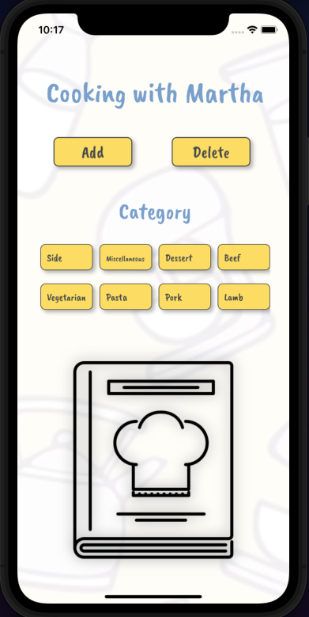
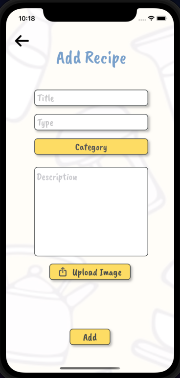
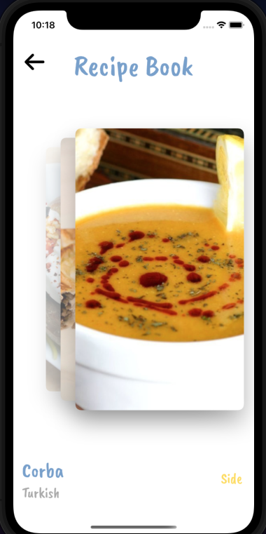

<h1 align="center">

Cooking With Martha

</h1>

## Objective
To create a recipe book using Cardslider. New recipes can be added and also deleted, existing recipes can be searched.

## Progress
- Cardsliders now displaying recipes from JSON
- ImagePicker added for uploading photos
- Dropdown now added as dependency for category selection
- Add and Delete recipe screens added
- New recipes now displayed as cards
- CollectionView implemented to display recipe categories
- Colour scheme updated across all screens

## Improvements
- Search functionality
- Further fleshing out of Individual cards to allow web and YT links

## Testing
5/5 UI test passing
1/1 Test passing

## Installation
1. Clone repository
2. Run!

## Screenshots

## Demo

## Tech Stack
Swift, UIKit

## Dependencies
- Cardslider
- Nuke
- KMPlaceholderTextView
- Dropdown

## Simulator Version
11

## Collaborators
@mattybwoy
